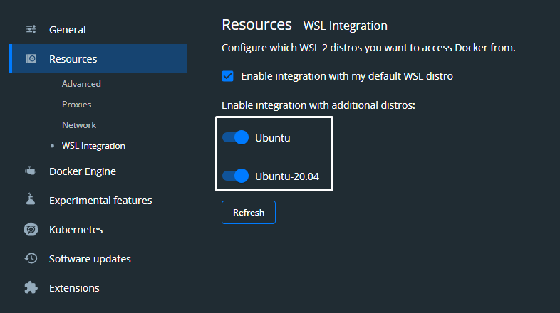

# Setting up our working Environment

## Prerequisites

Prerequisites:
- Running Ubuntu through WSL2 on Windows, Straight up Ubuntu, or MacOS
- Docker Compose is installed
- Basic knowledge of linux things
- Make sure Docker is running
- This extension on VSCode: `ms-vscode-remote.vscode-remote-extensionpack`

## Setting up Ubuntu WSL2 on Windows

fucking look it up yourself

## To install Docker Compose

`sudo apt-get update`

```
sudo apt-get install \
    ca-certificates \
    curl \
    gnupg \
    lsb-release
```

`sudo mkdir -p /etc/apt/keyrings`

`curl -fsSL https://download.docker.com/linux/ubuntu/gpg | sudo gpg --dearmor -o /etc/apt/keyrings/docker.gpg`

```
echo \
  "deb [arch=$(dpkg --print-architecture) signed-by=/etc/apt/keyrings/docker.gpg] https://download.docker.com/linux/ubuntu \
  $(lsb_release -cs) stable" | sudo tee /etc/apt/sources.list.d/docker.list > /dev/null
```

`sudo apt-get update`

`sudo apt-get install docker-ce docker-ce-cli containerd.io docker-compose-plugin`

## Have Docker Desktop opened in the background or

For Linux (idk about Windows and can't be fucked honestly)

`sudo service docker start`

Check if Docker is running

`sudo service docker status`

## Setting up Laravel Sail

First of all, find a snug comfy place for your project to rest

`mkdir ProjectFolder`

Go into said folder

`cd ProjectFolder`

Make sure in Docker Desktop that these options are enabled for whatever distro you are working on



Download the Docker Compose image

`curl -s "https://laravel.build/finalproject" | bash`

Go into the project folder

`cd finalproject`

Makes your life easier

`alias sail='[ -f sail ] && sh sail || sh vendor/bin/sail'`

Build the server for the first time

`sail up`

After the terminal calms the fuck down

`sail down` or `Ctrl+C` that shit if you can't

Add permissions to storage directory

`sudo chmod o+w ./storage/ -R`

`sudo chown -R www-data:www-data *`

Run the application again

`sail up -d`

Wait til all the containers are running then

`sail artisan storage:link`

To connect to the page, go to `localhost`
